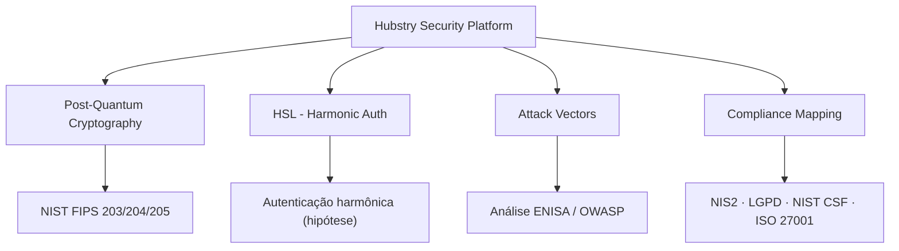

<div align="center">

# Hubstry Security Platform

**Cybersecurity platform with post-quantum cryptography and harmonic authentication**

*Plataforma de cibersegurança com criptografia pós-quântica e autenticação harmônica*

[](LICENSE)
[](post-quantum/README.md)
[](docs/architecture.md)
[](SECURITY.md)

</div>

---
## Incrementos / Latest Implementations

| Módulo | Arquivo | Descrição | Status |
|--------|---------|-----------|--------|
| **HSL Auth** | [`hsl/hsl_module.py`](hsl/hsl_module.py) | Autenticação H-Challenge/Response 3 etapas (meta histórica ~200 B, não validada) | Hipótese de pesquisa |
| **Detecção de Intrusão** | [`hsl/intrusion_detection.py`](hsl/intrusion_detection.py) | Desvio de fase Δφ > ε | Protótipo |
| **Rotação LFSR** | [`hsl/lfsr_key_rotation.py`](hsl/lfsr_key_rotation.py) | Rotação de chaves via LFSR | Protótipo |
| **π-Radical Operator** | — | Operador π-radical — 6 relações ρ₁-ρ₆ | Não presente neste repositório |
| **Lattice 64 Perfis** | [`quantum/lattice64.py`](quantum/lattice64.py), [`post-quantum/profile_lattice.py`](post-quantum/profile_lattice.py) | Lattice de 64 perfis harmônicos | Ver Current Research Status |
| **W Matrix Fixed-Point** | — | Matriz W — ponto fixo espectral | Não presente neste repositório |
| **Bound ρ₃ Quântico** | [`post-quantum/rho3_bound.py`](post-quantum/rho3_bound.py) | Limite quântico ρ₃ | Bloqueado (auditoria 2026-10-03) |
| **HSL Demo** | `python3 hsl/hsl_module.py` | Demonstração da simulação HSL | Simulação |

> Caminhos corrigidos em 2026-10-05: a versão anterior desta tabela citava `hsl_layer/`, `pi_radical/` e `demo/`, que não existem neste repositório. Ver [`docs/research/hsl-documentation-audit-2026-10.md`](docs/research/hsl-documentation-audit-2026-10.md).

---

## Current Research Status

**PR1 — Quantum Encoding & 64-Profile Lattice** · Status: **merged** (PR #2, 2026-10-03)

Validated (OBSERVED/DERIVED, 3 ambientes independentes):

- Comparação de encodings de fase harmônica (atual vs equatorial), n = 4…256;
- Encoding equatorial = phase encoding padrão da literatura; fidelidade
  `F = cos²(Δθ/2)`, uniforme em k (provado simbolicamente e numericamente);
- 64 perfis como encoding computacional em base de 6 qubits + projetor P_C;
- 136 casos pytest; 520 combinações (k,n) verificadas contra o baseline.

**Não reivindicado:** segurança quântica, vantagem quântica, nível
criptográfico. `post-quantum/rho3_bound.py`: auditado (Fases 1–2,
2026-10-03) — experimentalmente inválido e cientificamente bloqueado até
definição formal de f_ρ₃; não citar resultados do módulo. O bloqueio é da
implementação e da quantidade f_ρ₃; o conceito ρ₃ permanece objeto de
pesquisa. Registro experimental completo:
[`docs/research/pr1-quantum-encoding.md`](docs/research/pr1-quantum-encoding.md).

**HSL — Harmonic Security Layer** · Status: **hipótese de pesquisa**

O handshake de autenticação do HSL existe como simulação em
[`hsl/hsl_module.py`](hsl/hsl_module.py). A etapa de assinatura usa um
placeholder no lugar de ML-DSA-65.

**Não reivindicado:** tamanho de handshake validado, equivalência de
segurança com TLS 1.3, resistência quântica, autenticação mútua,
adequação validada a qualquer ambiente de aplicação. Auditoria documental
completa e achados de implementação:
[`docs/research/hsl-documentation-audit-2026-10.md`](docs/research/hsl-documentation-audit-2026-10.md).

**PQC (NIST FIPS 203/204/205)** · Status: **experimental, em revisão**

O provedor real de criptografia pós-quântica está no PR #5 (rascunho) e
ainda não foi integrado à `main`.

---

## [PT-BR] Sobre | [EN] About

### Sobre

A **Hubstry Security Platform** é uma framework de cibersegurança de propósito geral que integra quatro pilares fundamentais: **Criptografia Pós-Quântica** (NIST FIPS 203/204/205), **Autenticação Harmônica** (HSL — Harmonic Security Layer), **Análise de Vetores de Ataque** (ENISA 2025 + OWASP 2025) e **Conformidade Regulatória** (NIS2, LGPD, NIST CSF 2.0, ISO 27001).

Desenvolvida pela **Hubstry Deep Tech** (fundada em 2023), a plataforma tem origem no framework matemático **HALE** (Harmonic Addressing & Labeling Equation), que originou a investigação sobre subdivisões harmônicas racionais de uma frequência fundamental f0 e seu possível uso em endereçamento, segmentação de redes, contexto e segurança. As propriedades criptográficas dessa abordagem ainda são objeto de investigação experimental.

O módulo **HSL** investiga a hipótese de uma autenticação mais compacta que os mecanismos convencionais. O projeto explorou uma meta de aproximadamente 200 bytes por handshake; esse valor não foi validado experimentalmente. A implementação atual utiliza uma assinatura simulada como placeholder; a integração de uma assinatura ML-DSA-65 implicará requisitos de tamanho de mensagem significativamente diferentes, a serem medidos no protocolo efetivamente definido. Tamanho efetivo, custo computacional e propriedades de segurança ainda precisam ser medidos e analisados experimentalmente. Aplicações-alvo em investigação: IoT, telecomunicações e ambientes com recursos computacionais restritos.

### About

The **Hubstry Security Platform** is a general-purpose cybersecurity framework integrating four core pillars: **Post-Quantum Cryptography** (NIST FIPS 203/204/205), **Harmonic Authentication** (HSL — Harmonic Security Layer), **Attack Vector Analysis** (ENISA 2025 + OWASP 2025), and **Regulatory Compliance** (NIS2, LGPD, NIST CSF 2.0, ISO 27001).

Developed by **Hubstry Deep Tech** (founded in 2023), the platform originates from the **HALE** (Harmonic Addressing & Labeling Equation) mathematical framework, which started the investigation into rational harmonic subdivisions of a fundamental frequency f0 and their possible use in addressing, network segmentation, context and security. The cryptographic properties of this approach remain under experimental investigation.

The **HSL** module investigates the hypothesis of a more compact authentication than conventional mechanisms. The project explored a target of approximately 200 bytes per handshake; this value has not been experimentally validated. The current implementation uses a simulated placeholder signature; integrating an ML-DSA-65 signature will imply significantly different message-size requirements, to be measured on the protocol as actually defined. Effective size, computational cost and security properties still need to be measured and analysed experimentally. Target applications under investigation: IoT, telecommunications and resource-constrained environments.

---

## [PT-BR] Ecossistema Hubstry | [EN] Hubstry Ecosystem

Este repositório faz parte do ecossistema Hubstry:

| Repositório | Descrição | Link |
|----------------|-------------|------|
| **hubstry-hale-ecosystem** | Framework matemático HALE | [GitHub](https://github.com/guilherme-machado-ceo/hubstry-hale-ecosystem) |
| **iot-protocol-hubstry** | Protocolo IoT / HPG | [GitHub](https://github.com/guilherme-machado-ceo/iot-protocol-hubstry) |
| **qualia-hub-ecosystem** | Plataforma Qualia Hub | [GitHub](https://github.com/guilherme-machado-ceo/qualia-hub-ecosystem) |
| **hubstry-security** | Plataforma de cibersegurança (este repo) | [GitHub](https://github.com/guilherme-machado-ceo/hubstry-security) |

This repository is part of the Hubstry ecosystem:

| Repository | Description | Link |
|-----------|-------------|------|
| **hubstry-hale-ecosystem** | HALE mathematical framework | [GitHub](https://github.com/guilherme-machado-ceo/hubstry-hale-ecosystem) |
| **iot-protocol-hubstry** | IoT Protocol / HPG | [GitHub](https://github.com/guilherme-machado-ceo/iot-protocol-hubstry) |
| **qualia-hub-ecosystem** | Qualia Hub Platform | [GitHub](https://github.com/guilherme-machado-ceo/qualia-hub-ecosystem) |
| **hubstry-security** | Cybersecurity platform (this repo) | [GitHub](https://github.com/guilherme-machado-ceo/hubstry-security) |

---

## [PT-BR] Arquitetura | [EN] Architecture



**Módulos / Modules:**

| Módulo | Descrição / Description |
|--------|------------------------|
| [`post-quantum/`](post-quantum/) | Pesquisa pós-quântica; provedor NIST PQC (ML-KEM, ML-DSA, SLH-DSA) em revisão no PR #5 |
| [`hsl/`](hsl/) | Harmonic Security Layer — autenticação baseada em coerência harmônica |
| [`quantum/`](quantum/) | Trilha de pesquisa quântica (encodings de fase, lattice de 64 perfis) |
| [`attack-vectors/`](attack-vectors/) | Catálogo de 14+ vetores de ataque mapeados contra ENISA 2025 e OWASP 2025 |
| [`compliance/`](compliance/) | Mapeamento regulatório multi-framework com playbook de resposta a incidentes |
| [`docs/`](docs/) | Arquitetura detalhada, modelo de ameaças e especificações técnicas |
| [`roadmap/`](roadmap/) | Planejamento de desenvolvimento 2026-2027 e progressão TRL |

---

## [PT-BR] Início Rápido | [EN] Quick Start

### Pré-requisitos

- Git 2.40+
- Python 3.10+ (para exemplos de referência)
- liboqs: não necessário para a `main`; necessário para executar o provedor PQC do PR #5, caso integrado

### Clonar / Clone

```bash
git clone https://github.com/guilherme-machado-ceo/hubstry-security.git
cd hubstry-security
```

### Exemplo ilustrativo — derivação HALE

> **Ilustrativo e não funcional.** Este trecho não usa ML-KEM: a função calcula `fk` e o descarta, devolvendo o mesmo hash de `f0` para qualquer nível. Mantido como registro histórico; ver auditoria C05.

```python
from hashlib import sha256
import math

def hale_key_derivation(f0, level, b):
    phi = sum(1 for k in range(1, b) if math.gcd(k, b) == 1)
    fk = f0 * (phi ** level)
    return sha256(str(f0).encode()).digest()
```

---

## [PT-BR] Roadmap Técnico | [EN] Technical Roadmap

| Fase | Período | TRL | Entregáveis |
|------|------------|-----|-------------|
| **Fase 1** | A definir (original: Q2 2026) | 3-4 | Validação laboratorial do HSL; benchmarks contra TLS 1.3 |
| **Fase 2** | A definir (original: Q3 2026) | 4-5 | Integração ML-KEM-768 + HSL; PoC em ambiente controlado |
| **Fase 3** | A definir (original: Q1 2027) | 5-6 | Testes com parceiro de validação; conformidade NIS2 validada |

> As fases 1 e 2 não foram concluídas nos prazos originais e serão replanejadas; a fase 3 depende delas. As datas originais aparecem apenas como registro histórico; novas datas ainda não foram definidas.

Veja o roadmap completo em [`roadmap/2026-2027.md`](roadmap/2026-2027.md).

---

## [PT-BR] Conformidade Regulatória | [EN] Regulatory Compliance

- **ENISA NIS2** — Medidas de segurança de rede e informação (UE 2022/2555)
- **LGPD** — Lei Geral de Proteção de Dados (Brasil, Lei 13.709/2018)
- **NIST CSF 2.0** — Cybersecurity Framework v2.0 (2024)
- **ISO 27001:2022** — Information Security Management System
- **OWASP ASVS 4.0** — Application Security Verification Standard

Detalhes em [`compliance/`](compliance/).

---

## [PT-BR] Segurança | [EN] Security

Reporte vulnerabilidades em [`SECURITY.md`](SECURITY.md).

---

## [PT-BR] Contribuição | [EN] Contributing

Contribuições são bem-vindas! Consulte [`CONTRIBUTING.md`](CONTRIBUTING.md).

---

## [PT-BR] Licença | [EN] License

Este projeto está licenciado sob **CC BY-NC-SA 4.0** — uso não comercial. Veja [`LICENSE`](LICENSE).

This project is licensed under **CC BY-NC-SA 4.0** — non-commercial use. See [`LICENSE`](LICENSE).

---

<div align="center">

**Hubstry Deep Tech** | Fundada em 2023 | Brasil

[www.hubstry.dev](https://www.hubstry.dev) | [LinkedIn](https://www.linkedin.com/in/guilhermegoncalvesmachado)

</div>
