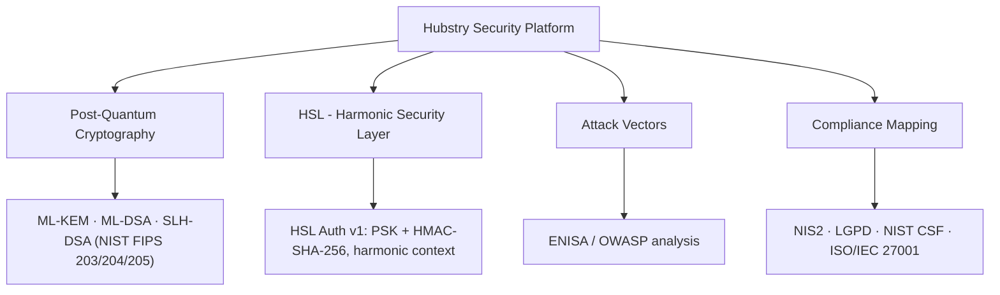

<div align="center">

# Hubstry Security Platform

**Post-quantum readiness, built on evidence**

*Prontidão pós-quântica, construída sobre evidência*

[](https://github.com/guilherme-machado-ceo/hubstry-security/actions/workflows/ci.yml)
[](post-quantum/README.md)
[](SECURITY.md)
[](LICENSE)

</div>

---

## The problem

The transition to post-quantum cryptography (PQC, cryptography designed to resist attacks by future quantum computers) is an engineering migration problem as much as a cryptographic one. Systems that protect long-lived data today may face a future in which cryptographically relevant quantum computing changes the threat model: data intercepted now could be decrypted later ("harvest now, decrypt later").

For constrained systems, such as IoT (Internet of Things) devices and resource-limited networks, the challenge is broader. Authentication, key establishment, protocol framing, implementation correctness and reproducibility all have to work together, and each step has to be backed by evidence before it becomes a claim.

## Origin: HALE

The platform originates in **HALE** (Harmonic Addressing & Labeling Equation), the mathematical framework developed by Hubstry Deep Tech since 2023. HALE studies rational harmonic subdivisions of a fundamental frequency *f0* and their use in addressing, network segmentation, context and security.

From HALE came the **HSL** (Harmonic Security Layer) research line: an authentication protocol in which harmonic phases bind each exchange to its context, while the security itself rests on standard, keyed cryptography. In HSL Auth v1, *f0* and the harmonic phases are protocol context, not secrets.

## What already works

| Verified project result | Evidence |
|---|---|
| Experimental provider for the three NIST (National Institute of Standards and Technology) post-quantum standards: ML-KEM-768 (key establishment, FIPS 203), ML-DSA-65 (signatures, FIPS 204) and SLH-DSA-SHA2-128s (hash-based signatures, FIPS 205), on the open-source liboqs 0.16.0 library, with 19 tests independently reproduced | [PQC reproduction report](docs/research/pr5-pqc-reproduction-report-2026-10.md) |
| HSL Auth v1, an experimental three-message handshake using a PSK (pre-shared key) and HMAC-SHA-256 (keyed message authentication), with 32 tests; mutation testing detected 5 of 5 deliberately introduced defects | [HSL v1 execution report](docs/research/hsl-v1-execution-report-2026-10.md) |
| Quantum-research track (harmonic phase encodings and a 64-profile lattice on 6 qubits), with 136 tests reproduced across three independent environments | [PR1 research record](docs/research/pr1-quantum-encoding.md) |
| Catalog of 14 attack vectors mapped against ENISA (European Union Agency for Cybersecurity) 2025 and OWASP (Open Worldwide Application Security Project) 2025 | [attack-vectors/](attack-vectors/) |
| Regulatory mapping for NIS2 (EU network and information security directive), LGPD (Brazil's General Data Protection Law), NIST CSF 2.0 (Cybersecurity Framework) and ISO/IEC 27001, with an incident-response playbook | [compliance/](compliance/) |

Component-level results are tracked separately from protocol integration and laboratory validation; see [Maturity and limitations](#maturity-and-limitations).

## Evidence-oriented engineering

The repository applies an explicit evidence discipline:

- **Independent reproduction:** no experimental result produced by a single agent is promoted to baseline evidence without independent reproduction, where technically feasible.
- **Required CI gates:** three CI (continuous integration) checks — syntax, general tests, and PQC tests with the liboqs backend required — must pass before any change enters `main`. This is enforced by the repository's branch ruleset.
- **Status separation:** implementation status, research hypothesis, measured result and validation maturity are documented separately, with a documentation audit that classifies each claim.
- **Human approval:** every merge requires explicit approval by the principal investigator.

See [CONTRIBUTING.md](CONTRIBUTING.md) for the evidence rule and the CI gate definitions.

## Architecture and modules



| Module | Description |
|---|---|
| [`post-quantum/`](post-quantum/) | Experimental NIST PQC provider (ML-KEM, ML-DSA, SLH-DSA) on liboqs, with crypto-agility, canonical transcript and HKDF (HMAC-based key derivation) |
| [`hsl/`](hsl/) | HSL Auth v1 handshake; prototypes of phase-deviation intrusion detection and LFSR-based (Linear Feedback Shift Register) key rotation; historical v0 simulation |
| [`quantum/`](quantum/) | Quantum-research track: harmonic phase encodings and the 64-profile lattice |
| [`attack-vectors/`](attack-vectors/) | Attack-vector catalog mapped against ENISA 2025 and OWASP 2025 |
| [`compliance/`](compliance/) | Multi-framework regulatory mapping with incident-response playbook |
| [`docs/`](docs/) | Architecture, threat model, research records, decision records and validation plans |
| [`tests/`](tests/) | Test suites, including the PQC suite and HSL v1 tests |
| [`roadmap/`](roadmap/) | Development roadmap and TRL (Technology Readiness Level) progression |

## Quick start

### Prerequisites

- Git 2.40+
- Python 3.10+
- For the PQC suite: liboqs 0.16.0 and liboqs-python 0.16.0. Without them the PQC suite is skipped locally; with `HUBSTRY_REQUIRE_PQC=1` (as in CI) a missing backend is a failure.

### Clone and run

```bash
git clone https://github.com/guilherme-machado-ceo/hubstry-security.git
cd hubstry-security

# General test suite
python -m pytest tests/ --ignore=tests/pqc -v

# PQC suite (requires liboqs 0.16.0)
HUBSTRY_REQUIRE_PQC=1 python -m pytest tests/pqc -v

# HSL Auth v1 demonstration
python hsl/hsl_auth_v1.py
```

## Next milestones

1. **ML-DSA in the HSL handshake (F-01b):** integrate post-quantum signatures into HSL Auth v1, with a canonical, versioned transcript.
2. **Digital Laboratory Twin:** a controlled, reproducible environment for system-level protocol validation.
3. **Integrated adversarial validation:** tampering, replay, substitution and other negative scenarios across the integrated system.

Dates for these milestones will be set after technical validation; the roadmap history is in [roadmap/2026-2027.md](roadmap/2026-2027.md).

## Ecosystem and compliance

Hubstry Security is part of the Hubstry research ecosystem:

| Repository | Role |
|---|---|
| [hubstry-hale-ecosystem](https://github.com/guilherme-machado-ceo/hubstry-hale-ecosystem) | HALE mathematical framework |
| [iot-protocol-hubstry](https://github.com/guilherme-machado-ceo/iot-protocol-hubstry) | IoT protocol research |
| [qualia-hub-ecosystem](https://github.com/guilherme-machado-ceo/qualia-hub-ecosystem) | Qualia Hub platform |
| [hubstry-security](https://github.com/guilherme-machado-ceo/hubstry-security) | This cybersecurity platform |

Frameworks mapped in [compliance/](compliance/):

- **NIS2** — EU network and information security measures (Directive (EU) 2022/2555)
- **LGPD** — Lei Geral de Proteção de Dados (Brazil, Law 13.709/2018)
- **NIST CSF 2.0** — Cybersecurity Framework v2.0 (2024)
- **ISO/IEC 27001:2022** — Information Security Management System
- **OWASP ASVS 4.0** — Application Security Verification Standard

## Partnerships

We are open to **research and validation partnerships** in post-quantum cryptography, protocol security, constrained systems and security experimentation.

Contact: **guilhermemachado.ceo@hubstry.dev**

## Resumo em português

A **Hubstry Security Platform** prepara sistemas para a migração à criptografia pós-quântica, com desenvolvimento orientado a evidência. Origina-se do **HALE** (Harmonic Addressing & Labeling Equation), framework matemático da Hubstry Deep Tech desenvolvido desde 2023, do qual nasceu a linha de pesquisa **HSL** (Harmonic Security Layer, camada de segurança harmônica).

Resultados verificados: provedor experimental com os três padrões pós-quânticos do NIST (ML-KEM-768, ML-DSA-65 e SLH-DSA), com 19 testes reproduzidos de forma independente; handshake HSL Auth v1 com 32 testes; trilha de pesquisa quântica com 136 testes em três ambientes; catálogo de 14 vetores de ataque; e mapeamento regulatório (NIS2, LGPD, NIST CSF 2.0, ISO/IEC 27001). Três verificações automáticas são obrigatórias antes de qualquer alteração entrar na versão principal.

Parcerias de pesquisa e validação: **guilhermemachado.ceo@hubstry.dev**.

## Maturity and limitations

Current technical status, non-claims and historical records: [`docs/STATUS.md`](docs/STATUS.md). TRL assessment: [`docs/TRL.md`](docs/TRL.md) — system-level TRL 4 is not yet established; component results are tracked separately from protocol and laboratory validation.

## Security, contributing and license

- **Security:** report vulnerabilities as described in [SECURITY.md](SECURITY.md).
- **Contributing:** see [CONTRIBUTING.md](CONTRIBUTING.md).
- **License:** [CC BY-NC-SA 4.0](LICENSE) (non-commercial use).

---

<div align="center">

**Hubstry Deep Tech** · Founded in 2023 · Brazil

[hubstry.dev](https://www.hubstry.dev) · [LinkedIn](https://www.linkedin.com/in/guilhermegoncalvesmachado)

</div>
