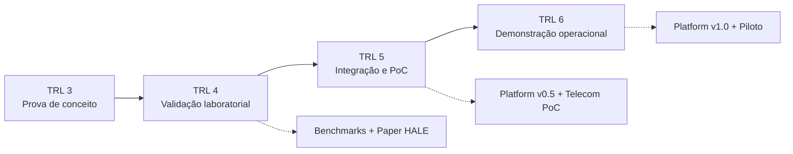

# Roadmap 2026-2027

## [PT-BR] Planejamento de Desenvolvimento | [EN] Development Roadmap

---

## Visão Geral / Overview

Este roadmap detalha a progressão da Hubstry Security Platform do **TRL 3** (prova de conceito) ao **TRL 6** (demonstração em ambiente operacional), a partir de abril de 2026, alinhado com o programa CISSA/EMBRAPII e as necessidades do mercado de cibersegurança pós-quântica.

This roadmap details the Hubstry Security Platform progression from **TRL 3** (proof of concept) to **TRL 6** (operational environment demonstration), starting April 2026, aligned with the CISSA/EMBRAPII program and post-quantum cybersecurity market needs.

---

## Fase 1 — Validação Laboratorial (Q2 2026)

**TRL 3 -> TRL 4** | Duração: 3 meses | Recursos necessários: ~R$ 25.000

### Objetivos / Objectives

- [ ] Benchmark HSL vs TLS 1.3 (CPU, memória, latência, throughput)
- [ ] Benchmark ML-KEM-768 com integração HALE
- [ ] Teste de resistência contra vetores AV-001 a AV-014
- [ ] Publicação do paper HALE em conferência (SBRC 2026 ou similar)
- [ ] Validação de side-channel resistance (constant-time arithmetic)

### Entregáveis / Deliverables

| Entregável | Formato | Data |
|--------------|---------|------|
| Benchmark report HSL vs TLS 1.3 | PDF + dataset | Jun 2026 |
| PQC integration proof | GitHub + demo video | Jun 2026 |
| Vulnerability assessment report | PDF | Jul 2026 |
| HALE paper (SBRC ou similar) | PDF (arXiv + conferência) | Jul 2026 |

---

## Fase 2 — Integração e PoC (Q3-Q4 2026)

**TRL 4 -> TRL 5** | Duração: 6 meses | Recursos necessários: CISSA + ~R$ 50.000

### Objetivos / Objectives

- [ ] Integração ML-KEM-768 + ML-DSA-65 com HSL
- [ ] Implementação do Compliance Engine (NIS2, LGPD, NIST CSF 2.0)
- [ ] Desenvolvimento do Threat Intel Dashboard
- [ ] PoC em ambiente controlado (laboratório)
- [ ] Carta de intenção de parceiro telecom

### Entregáveis / Deliverables

| Entregável | Formato | Data |
|--------------|---------|------|
| Hubstry Security Platform v0.5-alpha | GitHub release | Set 2026 |
| Telecom PoC results | PDF + demo | Dez 2026 |
| NIS2 compliance checklist | PDF | Dez 2026 |

---

## Fase 3 — Piloto e Demonstração (Q1 2027)

**TRL 5 -> TRL 6** | Duração: 6 meses | Recursos necessários: ~R$ 100.000

### Objetivos / Objectives

- [ ] Teste de campo com parceiro telecom
- [ ] Validação de conformidade NIS2 em ambiente de produção simulado
- [ ] Performance tuning para scale de produção
- [ ] Documentação para auditoria
- [ ] Preparação para comercialização

### Entregáveis / Deliverables

| Entregável | Formato | Data |
|--------------|---------|------|
| Hubstry Security Platform v1.0-beta | GitHub release | Mar 2027 |
| Telecom pilot report | PDF | Maio 2027 |
| ISO 27001 gap analysis | PDF | Jun 2027 |

---

## Marcos Estratégicos / Strategic Milestones
## Marcos Estratégicos / Strategic Milestones

| Fase | Período | TRL | Entregas principais |
|------|---------|-----|---------------------|
| Fase 1 | Q2 2026 | 3→4 | Benchmarks HSL vs TLS 1.3; Paper HALE |
| Fase 2 | Q3-Q4 2026 | 4→5 | Platform v0.5-alpha; Telecom PoC |
| Fase 3 | Q1 2027 | 5→6 | Platform v1.0-beta; Piloto telecom |
## Riscos e Mitigações / Risks and Mitigations

| Risco / Risk | Probabilidade | Impacto | Mitigação |
|-------------|---------------|---------|-----------|
| Falha na integração PQC + HSL | Média | Alto | Prototipagem iterativa; fallback para PQC puro sem HSL |
| Aceitação de parceiro telecom | Baixa | Crítico | Múltiplos parceiros prospectados (Claro, TIM, Vivo) |
| Evolução dos padrões NIST | Baixa | Médio | Design modular permite substituição de algoritmos |

---

*Hubstry Deep Tech — 2026-2027 Roadmap*
*Última atualização / Last updated: Abril 2026*