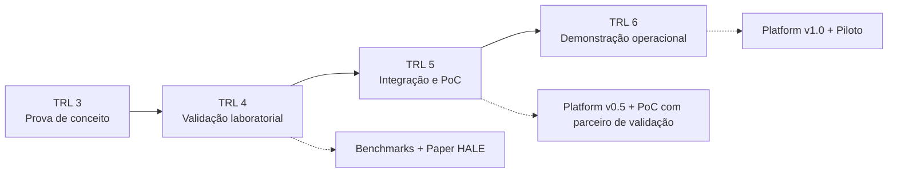

# Roadmap 2026-2027

## [PT-BR] Planejamento de Desenvolvimento | [EN] Development Roadmap

---

## Visão Geral / Overview

Este roadmap detalha a progressão da Hubstry Security Platform do **TRL 3** (prova de conceito) ao **TRL 6** (demonstração em ambiente operacional), a partir de abril de 2026, alinhado com as necessidades do mercado de cibersegurança pós-quântica.

This roadmap details the Hubstry Security Platform progression from **TRL 3** (proof of concept) to **TRL 6** (operational environment demonstration), starting April 2026, aligned with post-quantum cybersecurity market needs.

> **Atualização de 2026-10-05.** As fases 1 e 2 não foram concluídas nos prazos originais e serão replanejadas; a fase 3 depende delas e também fica sem data; as datas originais aparecem abaixo apenas como registro histórico e novas datas ainda não foram definidas. O roadmap descreve necessidades de validação e experimentação, não um mercado escolhido: marcos antes associados a telecom passam a se referir a um parceiro de validação a definir. Ver [`docs/research/hsl-documentation-audit-2026-10.md`](../docs/research/hsl-documentation-audit-2026-10.md).
>
> **Update of 2026-10-05.** Phases 1 and 2 were not completed on their original dates and will be replanned; phase 3 depends on them and is also undated; original dates appear below only as a historical record and new dates have not been set. The roadmap describes validation and experimentation needs, not a pre-selected market: milestones previously tied to telecom now refer to a validation partner to be defined.

---

```mermaid
flowchart LR
    A[TRL 3<br/>Prova de conceito] --> B[TRL 4<br/>Validação laboratorial]
    B --> C[TRL 5<br/>Integração e PoC]
    C --> D[TRL 6<br/>Demonstração operacional]
    B -.-> B1[Benchmarks + Paper HALE]
    C -.-> C1[Platform v0.5 + PoC com parceiro de validação]
    D -.-> D1[Platform v1.0 + Piloto]
```

## Fase 1 — Validação Laboratorial (data a definir; original: Q2 2026)

**TRL 3 -> TRL 4** | Duração: 3 meses | Recursos necessários: ~R$ 25.000

### Objetivos / Objectives

- [ ] Benchmark HSL vs TLS 1.3 (CPU, memória, latência, throughput)
- [ ] Benchmark ML-KEM-768 com integração HALE
- [ ] Teste de resistência contra vetores AV-001 a AV-014
- [ ] Publicação do paper HALE em conferência (a definir; original: SBRC 2026)
- [ ] Validação de side-channel resistance (constant-time arithmetic)

### Entregáveis / Deliverables

| Entregável | Formato | Data |
|--------------|---------|------|
| Benchmark report HSL vs TLS 1.3 | PDF + dataset | A definir (original: Jun 2026) |
| PQC integration proof | GitHub + demo video | A definir (original: Jun 2026) |
| Vulnerability assessment report | PDF | A definir (original: Jul 2026) |
| HALE paper (conferência a definir) | PDF (arXiv + conferência) | A definir (original: Jul 2026) |

---

## Fase 2 — Integração e PoC (data a definir; original: Q3-Q4 2026)

**TRL 4 -> TRL 5** | Duração: 6 meses | Recursos necessários: ~R$ 50.000

### Objetivos / Objectives

- [ ] Integração ML-KEM-768 + ML-DSA-65 com HSL
- [ ] Implementação do Compliance Engine (NIS2, LGPD, NIST CSF 2.0)
- [ ] Desenvolvimento do Threat Intel Dashboard
- [ ] PoC em ambiente controlado (laboratório)
- [ ] Carta de intenção de parceiro de validação

### Entregáveis / Deliverables

| Entregável | Formato | Data |
|--------------|---------|------|
| Hubstry Security Platform v0.5-alpha | GitHub release | A definir (original: Set 2026) |
| Resultados da PoC com parceiro de validação | PDF + demo | A definir (original: Dez 2026) |
| NIS2 compliance checklist | PDF | A definir (original: Dez 2026) |

---

## Fase 3 — Piloto e Demonstração (data a definir; original: Q1 2027)

**TRL 5 -> TRL 6** | Duração: 6 meses | Recursos necessários: ~R$ 100.000

### Objetivos / Objectives

- [ ] Teste de campo com parceiro de validação
- [ ] Validação de conformidade NIS2 em ambiente de produção simulado
- [ ] Performance tuning para scale de produção
- [ ] Documentação para auditoria
- [ ] Preparação para comercialização

### Entregáveis / Deliverables

| Entregável | Formato | Data |
|--------------|---------|------|
| Hubstry Security Platform v1.0-beta | GitHub release | A definir (original: Mar 2027) |
| Relatório do piloto | PDF | A definir (original: Maio 2027) |
| ISO 27001 gap analysis | PDF | A definir (original: Jun 2027) |

---

## Marcos Estratégicos / Strategic Milestones
## Marcos Estratégicos / Strategic Milestones

| Fase | Período | TRL | Entregas principais |
|------|---------|-----|---------------------|
| Fase 1 | A definir (original: Q2 2026) | 3→4 | Benchmarks HSL vs TLS 1.3; Paper HALE |
| Fase 2 | A definir (original: Q3-Q4 2026) | 4→5 | Platform v0.5-alpha; PoC com parceiro de validação |
| Fase 3 | A definir (original: Q1 2027) | 5→6 | Platform v1.0-beta; Piloto |
## Riscos e Mitigações / Risks and Mitigations

| Risco / Risk | Probabilidade | Impacto | Mitigação |
|-------------|---------------|---------|-----------|
| Falha na integração PQC + HSL | Média | Alto | Prototipagem iterativa; fallback para PQC puro sem HSL |
| Aceitação de parceiro de validação | Baixa | Crítico | Potenciais parceiros e ambientes de aplicação, a definir após validação técnica e comercial |
| Evolução dos padrões NIST | Baixa | Médio | Design modular permite substituição de algoritmos |

---

*Hubstry Deep Tech — 2026-2027 Roadmap*
*Última atualização / Last updated: Outubro 2026 (requalificação documental; versão original: Abril 2026)*